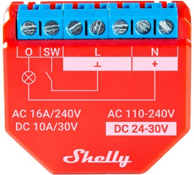
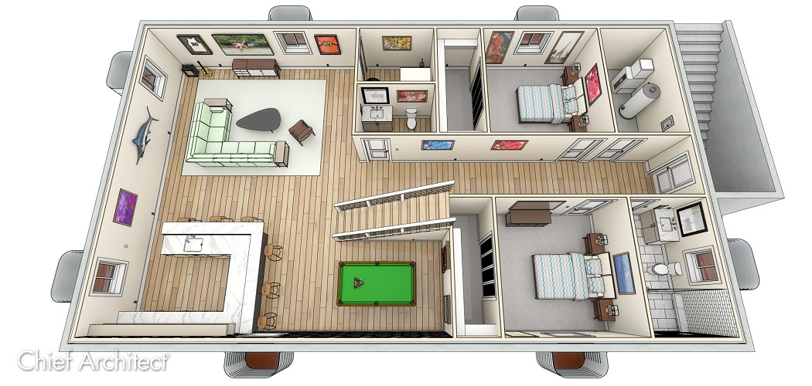

## Device configuration

Each Shelly device on the map is represented by a simple HTML block.
This block defines **where the device is located**, **how it is displayed**, and **which links are available**.

### Basic device block example

```html
<!-- DEVICE 1 -->
<div class="device" style="--top:25; --left:50;">
    
    <div class="device-title">Plus1PM</div>
    <div class="device-links">
        <a href="http://192.168.8.162" target="_blank">192.168.8.162</a>
        <a href="http://192.168.8.162/script/1" target="_blank">Script1</a>
        <a href="http://192.168.8.162/rpc/Shelly.GetStatus" target="_blank">Status</a>
    </div>
</div>
```

### Positioning devices on the map

Device position is controlled using inline CSS variables:

- `--top`  – vertical position (in percent)
- `--left` – horizontal position (in percent)

Both values are relative to the floor map image.

Example:

```html
<div class="device" style="--top:25; --left:50;">
```

This places the device approximately in the center of the map.

Positioning is done manually to keep the system simple and predictable.
No JavaScript or automatic layout logic is used.

### Why IP addresses are shown

Each device block usually contains the **local IP address** of the Shelly device.

This is intentional:

- no need to remember IP addresses,
- quick access to the Shelly Web UI,
- direct links to running scripts,
- fast access to the status endpoint.

All IP addresses must be **updated by the user** to match their own local network.

The addresses in this repository are examples using private RFC1918 ranges.

### Device links

Inside `.device-links` you can add any links that are useful for your setup:

- main Shelly Web UI
- specific scripts (`/script/x`)
- status endpoint (`/rpc/Shelly.GetStatus`)
- or any custom endpoint provided by your scripts

You can freely add or remove links depending on your needs.

### Devices without images (optional)

If device images feel visually too heavy, they can be removed.
The device card will then display **text-only information**.

```html
<!-- DEVICE 5 -->
<div class="device" style="--top:39; --left:40;">
    <!--  image disabled -->
    <div class="device-title">Plus1PM Heater</div>
    <div class="device-links">
        <a href="http://192.168.8.119" target="_blank">192.168.8.119</a>
        <a href="http://192.168.8.119/script/4" target="_blank">Script4</a>
        <a href="http://192.168.8.119/rpc/Shelly.GetStatus" target="_blank">Status</a>
    </div>
</div>
```

## Floor structure

Each floor is defined as a separate section in the HTML file.

```html
<section class="floor">
    <h3 class="floor-title">Floor 01</h3>

    <figure class="map">
        

        <!-- devices for this floor go here -->

    </figure>
</section>
```

### Adding or removing floors

1. Copy an existing `<section class="floor">` block.
2. Change the floor title.
3. Replace the map image.
4. Add or move device blocks inside the map.

There is no hard limit on the number of floors.

## Customizing maps and images

### Floor maps

- Place your floor images in the `maps/` directory.
- Replace the default images with your own floor plans.
- Image size is flexible; the layout scales automatically.

### Device images

- Device icons are stored in the `img/` directory.
- You can add your own images if a device type is missing.
- Any browser-supported image format can be used.

If an image is not needed, simply remove or comment out the `` tag.

---

This project is designed for people who want a **simple and transparent overview**
of their Shelly setup without introducing complex infrastructure.
Basic HTML knowledge is required for customization, but no advanced programming skills are needed.
